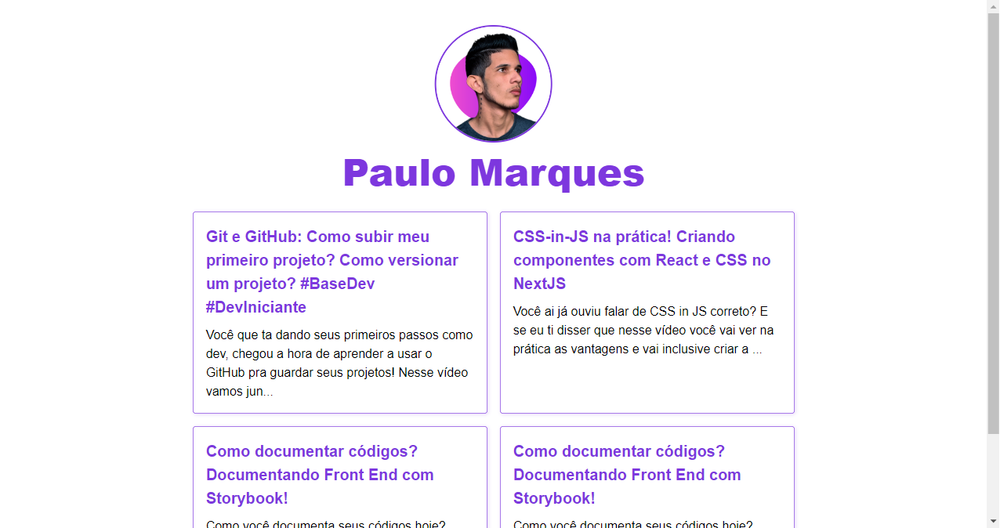

# Tour pelo Next.js

> Tour pelo Next.js

Projeto construído durante o curso Next.js: tour pelo Next.js, ministrado pela Alura.

<!-- [Clique aqui para acessar](https://aluratube-ten-drab.vercel.app/) -->

## Tecnologias

- Next.js
- React.js
- Skynex UI

## 💻 Projeto

O página de post no estilo blog. A página foi desenvolvida usando Next.js. O objetivo geral do curso foi entender quais cenários de aplicação dos recursos do Next.js.
